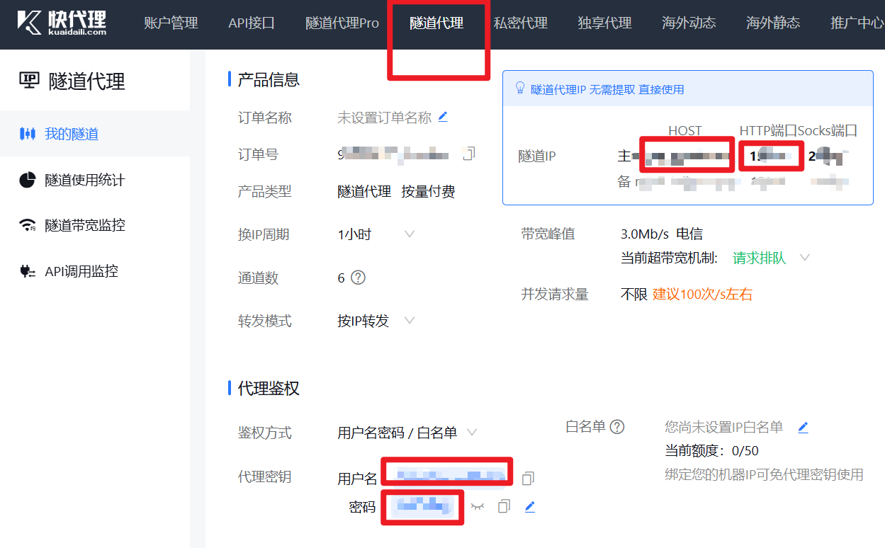
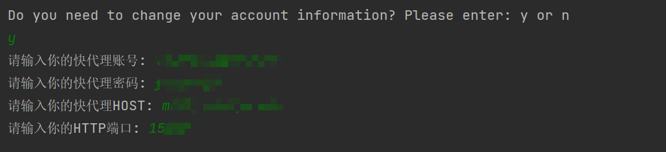
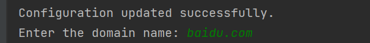
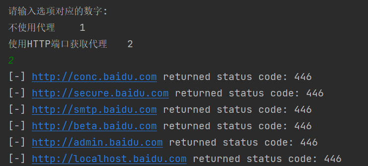
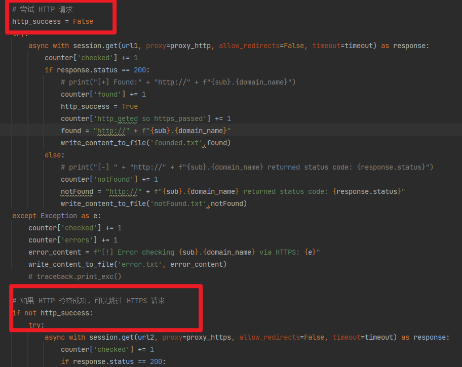
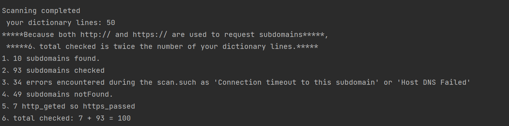
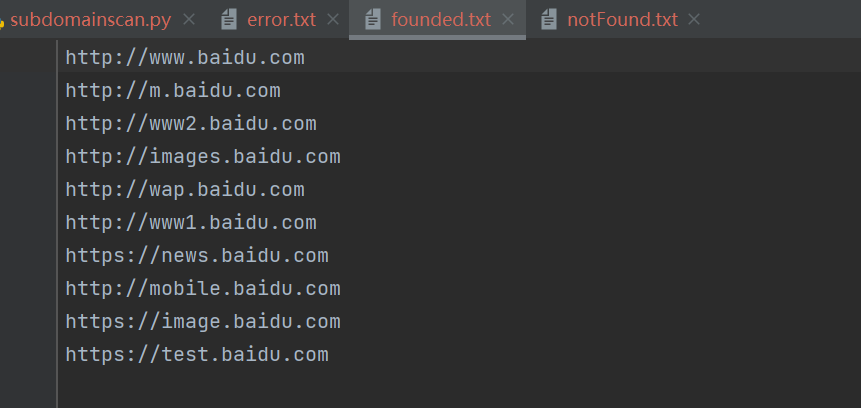

# subdomainscan

#### 介绍

A subdomain scaner
默认字典是dictionary.txt,只有50条,需要的请自行扩充.

因为是主动信息收集,所以建议挂代理,推荐使用快代理的隧道代理: 记录下你的用户名、密码、主host和http端口

 

\###安装教程

### Linux User

1. apt 安装 python
2. apt 安装 git
3. git clone https://gitee.com/Cyberspace-Security-Poet/subdomainscan.git
4. cd subdomainscan
5. pip install -r environment.txt
6. python subdomainscan.py

### Termux User

1. pkg install python
2. pkg install git
3. git clone https://gitee.com/Cyberspace-Security-Poet/subdomainscan.git
4. cd subdomainscan
5. pip install -r environment.txt
6. python subdomainscan.py

### Windows User

1. git clone https://gitee.com/Cyberspace-Security-Poet/subdomainscan.git
2. cd subdomainscan
3. pip install -r environment.txt
4. python subdomainscan.py

#### 使用说明

1. 记录好你的快代理--隧道代理相关信息后,python subdomainscan.py会让你选择是否更改你的账户信息,建议第一次选择y,更改好你的账户信息: 

   

2. 成功修改后如下图所示,让你输入想要扫描的域名,这里我们输入baidu.com 

   

3. 这里我们需要选择使用代理,所以输入2 

    

4. 之后程序便能成功运行,如果未能扫描到,会返回状态码,如上图所示.

5. 运行结束后,会统计扫描了哪些信息,这里我们使用的字典只有50条,但在扫描的时候会把[http://subdomain.domain和https](https://gitee.com/link?target=http%3A%2F%2Fsubdomain.xn--domainhttps-d14s)/subdomain.domain都考虑到,如果[http://subdomain.domain被扫描到了](https://gitee.com/link?target=http%3A%2F%2Fsubdomain.xn--domain-8e8i73wop3bz5ctz4l),就不会再扫描[https://subdomain.domain](https://gitee.com/link?target=https%3A%2F%2Fsubdomain.domain),这样能够提高效率: 

   

   运行完成后,会统计扫描信息:

   

6. 最终,会将扫描到的子域名保存到found.txt中,将报错的子域名和报错信息保存到error.txt中,将没找到的子域名保存到notFound.txt中

   

   

#### 参与贡献

Cyberspace-Security-Poet
